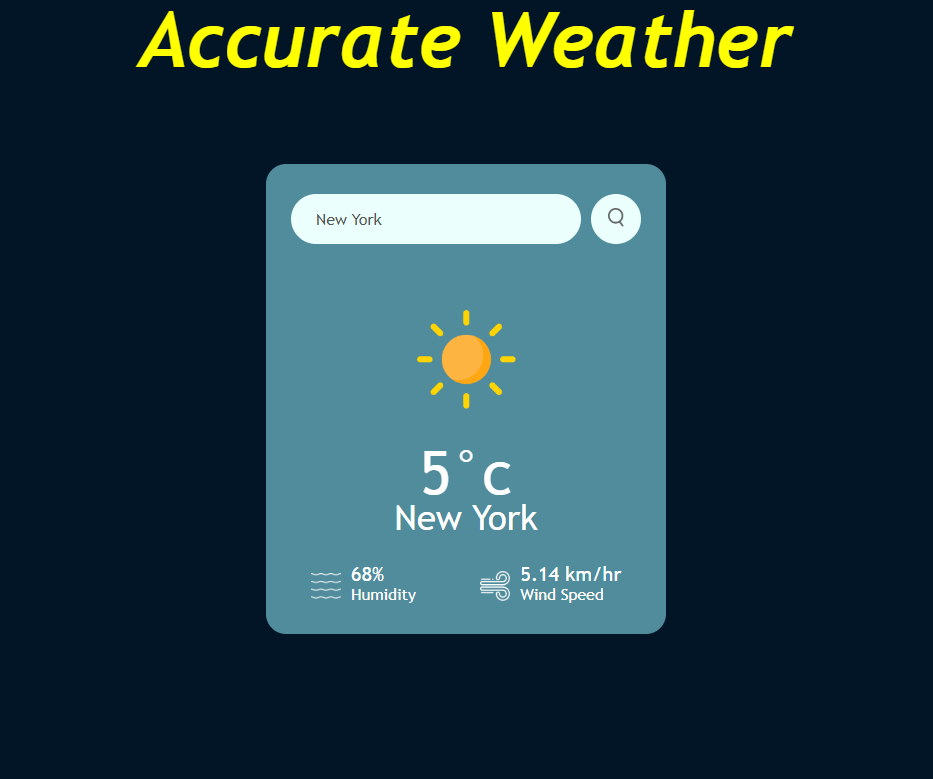

# 🌦 Weather App

This **Accurate Weather App** provides real-time weather updates for any location worldwide. Built using HTML, CSS, JavaScript, and a weather API, it features a modern, responsive design that works seamlessly across all devices.



---

## 🌟 Features

- 🌍 **Global Weather**: Get weather updates for any city around the world.
- 📱 **Responsive Design**: Optimized for desktop, tablet, and mobile screens.
- 🌡️ **Real-Time Data**: Fetches live weather data using a weather API.
- 🎨 **User-Friendly UI**: Minimalistic and modern interface.

---

## 📸 Demo

Check out the app in action!  


---

## 🚀 Technologies Used

- **HTML5** for structuring the app.
- **CSS3** for styling and responsive design.
- **JavaScript (ES6)** for functionality.
- **Weather API** for real-time weather data.

---

## 📂 Project Structure

```plaintext
📁 project-directory
├── 📁 images
│   ├── weather-app-screenshot.png
│   └── weather-app-demo.gif
├── 📁 css
│   └── styles.css
├── 📁 js
│   └── script.js
└── index.html
